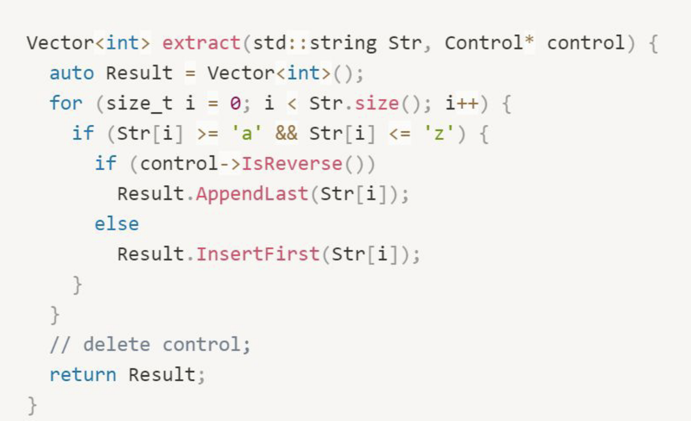

#### Review of code



1. The return type should be `std::vector<int>`
2. The method name should be more expressive to reflect what the function is doing. Something like `extractLowercaseAsciiCodes` would suffice (assuming this is an english language code and user base, otherwise might be worthwhile to include that we only want lowercase english alpha characters).
3. The input parameter `Str`
   1. can be a const reference like `const std::string&` because the value is never changed.
   2. could be better named to something like `input`, or at the very least should start with a lowercase character.
4. The input parameter `control`
   1. could be passed as a boolean value like `bool reverseResult` to better reflect its use.
   2. if it needs to be passed as a pointer to a `Control` object then should be a const pointer to a const object because it's never changed, like `const Control* const control`.
5. There's no benefit to using an `auto Result` because we know it's a vector.
6. The `Result` could better be declared as `std::vector<int> result;`
   1. a `std::vector` has move semantics so returning it will result in it being moved on return, and in some cases the move is optimized away by the compiler - this is most likely one of those cases
   2. the use of `result` keeps consistent lowercase naming of local variables.
   3. and there's no need to call the constructor
7. The entire loop can be optimized by using a `for (const unsigned char character: input)` to iterate over all the characters in `input`. 
   1. the use of `const unsigned char` optimizes some of the comparisons we're going to be doing
   2. we won't need to keep indexing into the input string to get the character
8. We shouldn't be checking if we're reversing the results inside the loop. We can deal with that after we've already extracted all the lowercase letters. This will remove a repeated conditional inside the loop which is a big performance gain.
9. Without seeing the code for the `Vector` type (because it's not `std::vector`), I can't say whether or not the returned result will be properly copied to the caller, or if we're going to end up with a compilation or runtime error.


### Alternative Implementation

The alternative and tests can be seen in [main.cpp](./main.cpp).
Result output is

```bash
$> c++ -g -std=gnu++11 main.cpp -o app
$> ./app
abcdefghijklmnopqrstuvwxyz ==> 'abcdefghijklmnopqrstuvwxyz' ==> [ 97 98 99 100 101 102 103 104 105 106 107 108 109 110 111 112 113 114 115 116 117 118 119 120 121 122 ]
abcdefghijklmnopqrstuvwxyz ==> 'zyxwvutsrqponmlkjihgfedcba' ==> [ 122 121 120 119 118 117 116 115 114 113 112 111 110 109 108 107 106 105 104 103 102 101 100 99 98 97 ]

ABCDEFGHIJKLMNOPQRSTUVWXYZ ==> '' ==> [ ]
ABCDEFGHIJKLMNOPQRSTUVWXYZ ==> '' ==> [ ]

Mixture Of caseS ==> 'ixturefcase' ==> [ 105 120 116 117 114 101 102 99 97 115 101 ]
Mixture Of caseS ==> 'esacferutxi' ==> [ 101 115 97 99 102 101 114 117 116 120 105 ]

123abc456DEf4dg4GRW ==> 'abcfdg' ==> [ 97 98 99 102 100 103 ]
123abc456DEf4dg4GRW ==> 'gdfcba' ==> [ 103 100 102 99 98 97 ]

```